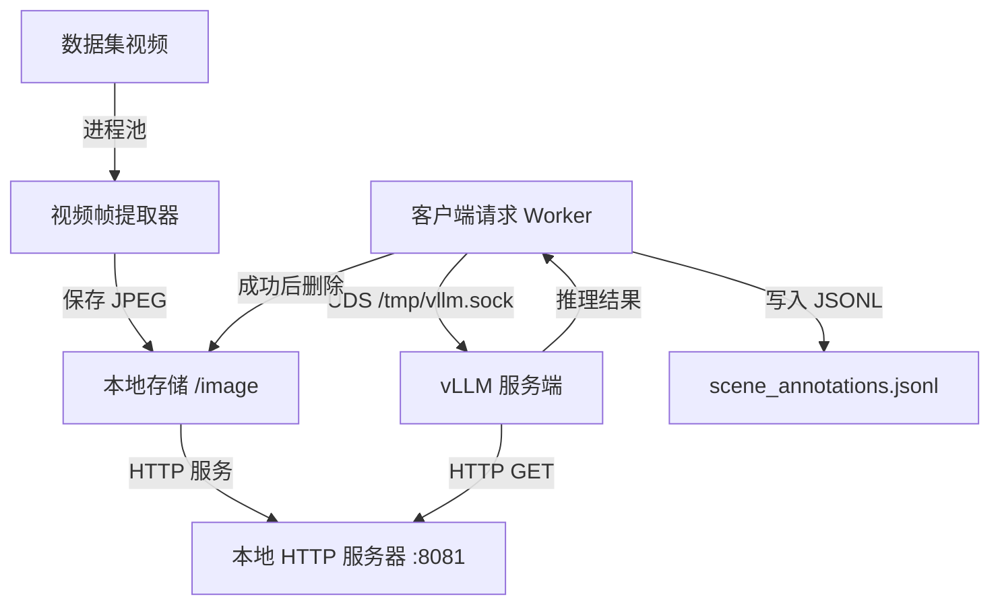

# 视频场景标注流水线 (Scene Annotation Pipeline)

基于 **vLLM** 和 **Qwen2-VL** 的高性能并行视频场景标注系统。

## 🚀 核心特性

*   **客户端-服务端架构 (Client-Server)**：将推理引擎 (vLLM) 与数据处理逻辑 (Client) 解耦。
*   **极致性能**：
    *   **UDS (Unix Domain Socket)**：客户端与服务端之间实现零开销通信（绕过 TCP/IP 协议栈）。
    *   **本地图片流 (Local Image Streaming)**：通过本地 HTTP 服务实现零拷贝图片传输（避免 Base64 编解码造成的 CPU 瓶颈）。
    *   **全链路并行**：
        *   服务端：支持 Continuous Batching（连续批处理）和 PagedAttention。
        *   客户端：多进程视频帧提取 + 异步并发 HTTP 请求。
*   **高健壮性**：支持失败自动重试、条件性文件清理以及优雅停机。

## 🛠️ 架构设计



## 📦 安装指南

1.  **安装依赖**：
    ```bash
    pip install -r requirements.txt
    ```

2.  **模型准备**：
    请确保您拥有访问 `Qwen/Qwen2-VL-7B-Instruct` 模型的权限或已下载该模型。

## 🚦 使用方法

### 1. 启动 vLLM 服务端
服务端负责繁重的 LLM 推理任务。它监听 Unix Socket 以获得最大传输速度。

```bash
./start_vllm_server.sh
```
*等待直到看到日志显示 "Uvicorn running on..."*

### 2. 运行标注客户端
客户端负责扫描视频、提取关键帧，并并行发送请求给服务端。

```bash
python generate_scene_annotations_client.py
```

### 3. 配置说明
您可以修改 `generate_scene_annotations_client.py` 中的 `Config` 类：
*   `NUM_REQUEST_WORKERS`: 并发请求数（默认：64）。
*   `SHOW_HTTP_LOGS`: 是否显示详细的 HTTP 请求日志（开关）。
*   `MAX_RETRIES`: 请求失败时的最大重试次数。

## 📝 输出格式
结果将保存为 `scene_annotations_client.jsonl` 文件：
```json
{"episode_idx": 123, "scene_annotation": "一个机械臂正在抓取红色的苹果。"}
```
